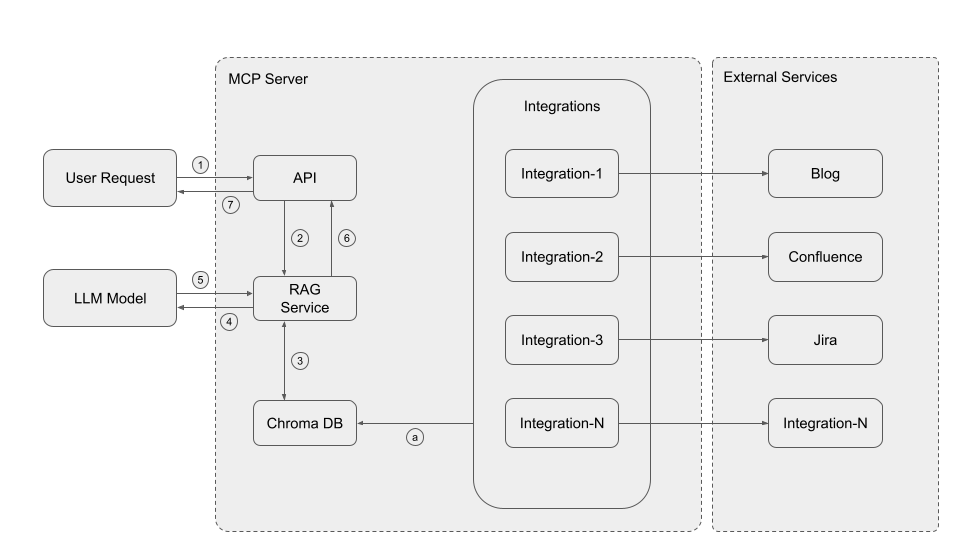

# MCP Server PoC

This repository contains a proof of concept (**PoC**) that demonstrates a simple *Retrieval Augmented Generation* (RAG) flow built with Python and [LangChain](https://python.langchain.com/) using [Chroma](https://www.trychroma.com/) as the vector database.

## Introduction

The project downloads information from several sources (called *integrations*) and stores it in Chroma. From there a small API is exposed so that an LLM can generate answers using those documents.

## Getting Started

1. **Prepare the environment**
   ```bash
   python -m venv venv
   source venv/bin/activate
   pip install -r requirements.txt
   ```
2. **Configure credentials**
   - Copy `api/config/config_template.json` to `api/config/config.json`.
   - Fill in the `llmAPI` field with your Model API key if needed or set the proper environment variable.
3. **Start the server**
   ```bash
   python main.py
   ```
   The service will be available at `http://localhost:5000`.

## Architecture





| Step | Component         | Description                                                                                 |
|------|-------------------|---------------------------------------------------------------------------------------------|
| 1    | API               | **User request is received** from any channel (UI, Slack, etc.)                             |
| 2    | API → RAG Service | **API forwards the question** to the RAG Service                                            |
| 3    | RAG Service       | **Queries the Chroma DB** to retrieve relevant, pre-indexed documents from the integrations |
| 4    | RAG Service       | **Composes a prompt** with the question and the retrieved context and send it to the LLM    |
| 5    | LLM               | **Generates an answer** based on the enriched prompt                                        |
| 6    | RAG Service → API | **Returns the generated response** to the API                                               |
| 7    | API               | **Sends the final response** back to the user                                               

---

> ℹ️ **Note on step `a`**:  
> This is not part of the real-time flow. Step `a` represents a periodic and asynchronous process where integrations fetch data from external services (e.g., Blog, Confluence, Jira) and update the Chroma DB in the background.

## How does it work?

When the server starts all registered integrations in `integrations/` are executed. Each integration downloads its documents, splits them into chunks and stores them in Chroma. Later, when a request is made to `/ask`, the most relevant chunks are searched in the vector store, a prompt is built with them and sent to the LLM model. The model response is returned along with the prompt so that the process can be debugged or reviewed.