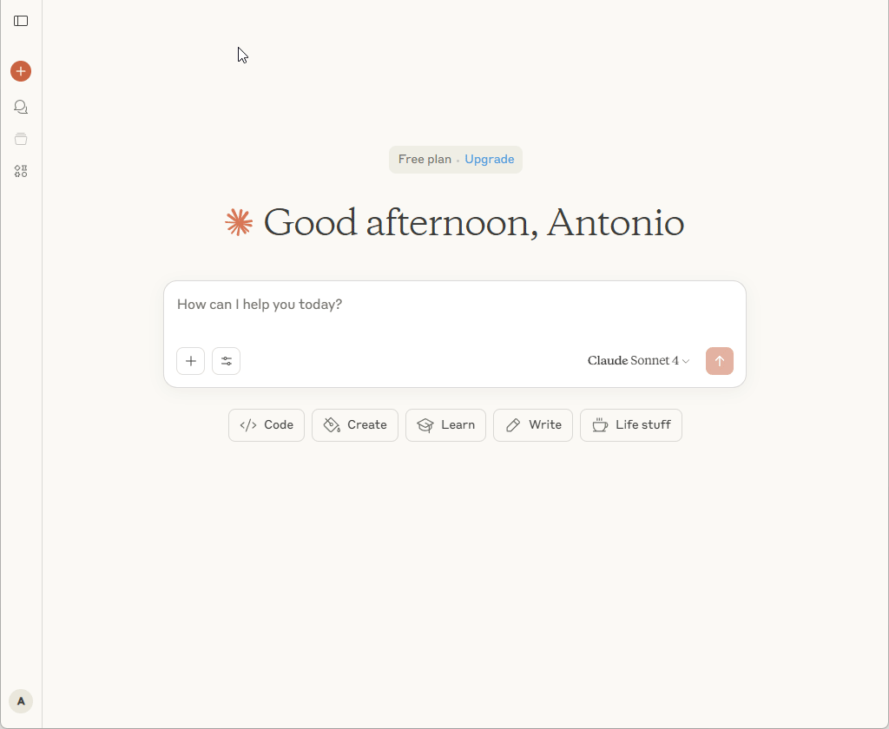
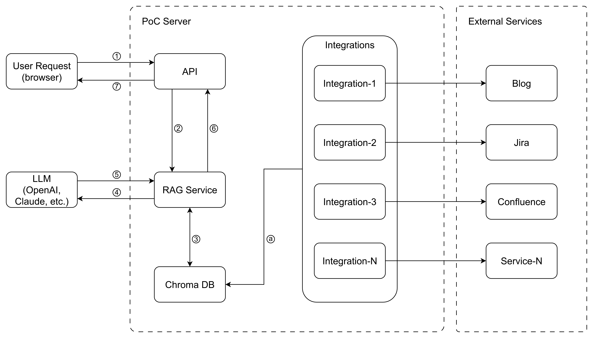
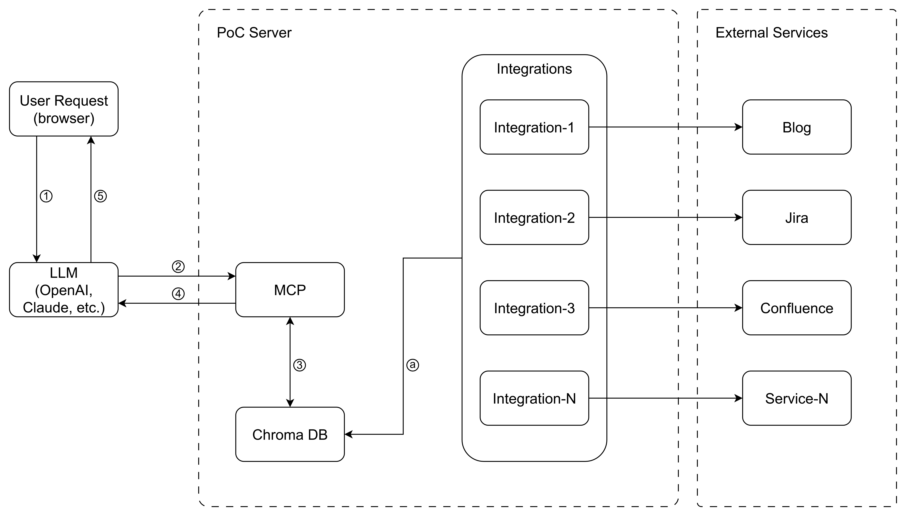

## About this project

This starter PoC exposes **two modes** for semantic search and generation:

1. **RAG API**: A classic Retrieval-Augmented Generation endpoint  
   - Builds a prompt from user input + retrieved context  
   - Calls the LLM and returns the enriched answer  
2. **MCP Server**: A tool-based interface directly invoked by an LLM  
   - Exposes vector search over ChromaDB as “tools”  
   - LLM can call `search(...)` to fetch raw docs + scores

Under the hood, an **Integrations Manager** continuously ingests data from external systems (Blog, Jira, Confluence, …) into ChromaDB. All components share a singleton Chroma client and a common logger.

## Live Demo

Below is a short demo of the MCP server in action. A similar demonstration for the API server is still in progress.



## API workflow




| Point | Action                                                                                                     |
|:-----:|------------------------------------------------------------------------------------------------------------|
|   1   | **API receives** the user’s request from the browser, script, tools like Postman, etc.                     |
|   2   | **API forwards** the request to the RAG Service for semantic processing.                                   |
|   3   | **RAG Service queries** the Chroma vector database to retrieve the most relevant embeddings/documents.     |
|   4   | **RAG Service sends** the retrieved context plus user query as a prompt to the LLM (OpenAI, Claude, etc.). |
|   5   | **LLM processes** the prompt and returns a generated response to the RAG Service.                          |
|   6   | **RAG Service returns** the assembled answer back to the API.                                              |
|   7   | **API sends** the final response back to the user’s browser.                                               |


## MCP workflow



| Point | Action                                                                                     |
|:-----:|--------------------------------------------------------------------------------------------|
|   1   | **LLM receives** the user’s request directly from the browser.                             |
|   2   | **LLM forwards** the request to the MCP server for orchestration.                          |
|   3   | **MCP server queries** the Chroma DB to retrieve relevant embeddings/documents.            |
|   4   | **MCP server returns** the assembled context (from Chroma + integrations) back to the LLM. |
|   5   | **LLM sends** the final generated response back to the user’s browser.                     |

> **Note**: Before this flow, ensure your chosen LLM is enabled to act as an MCP client (i.e. supports the MCP Server protocol) and is configured with the correct MCP server endpoint so it can connect and exchange messages.

> ℹ️ **Note on step `a`**:  
> This is not part of the real-time flow. Step `a` represents a periodic and asynchronous process where integrations fetch data from external services (e.g., Blog, Confluence, Jira) and update the Chroma DB in the background.

## Getting Started

1. **Prepare the environment**
   ```bash
   python -m venv venv
   source venv/bin/activate
   pip install -r requirements.txt
   ```
2. **Configure credentials**
   - Copy `api/config/config_template.json` to `api/config/config.json`.
   - Fill in the `llmAPI` field with your Model API key if needed or set the proper environment variable.
3. **Start the server**
   ```bash
   python main.py
   ```
   The service will be available at `http://localhost:5000`.

## How does it work?

When the server starts all registered integrations in `integrations/` are executed. Each integration downloads its documents, splits them into chunks and stores them in Chroma. Later, when a request is made to `/ask`, the most relevant chunks are searched in the vector store, a prompt is built with them and sent to the LLM model. The model response is returned along with the prompt so that the process can be debugged or reviewed.