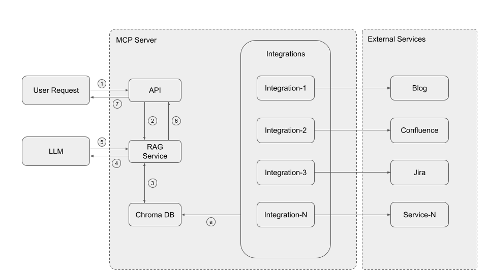

# RAG PoC

This repository contains a proof of concept (**PoC**) that demonstrates a simple *Retrieval Augmented Generation* (RAG) flow built with Python and [LangChain](https://python.langchain.com/) using [Chroma](https://www.trychroma.com/) as the vector database.

## Introduction

The project downloads information from several sources (called *integrations*) and stores it in Chroma. From there a small API is exposed so that an LLM can generate answers using those documents.

## Getting Started

1. **Prepare the environment**
   ```bash
   python -m venv venv
   source venv/bin/activate
   pip install -r requirements.txt
   ```
2. **Configure credentials**
   - Copy `api/config/config_template.json` to `api/config/config.json`.
   - Fill in the `llmAPI` field with your Model API key if needed or set the proper environment variable.
3. **Start the server**
   ```bash
   python main.py
   ```
   The service will be available at `http://localhost:5000`.

## Architecture





1. **User Request is received by the MCP API**  
   The user sends a question via any channel (UI, Slack, etc.), and it reaches the API layer of the MCP Server.

2. **The API forwards the request to the RAG Service**  
   The RAG component handles orchestrating the information retrieval and response generation.

3. **RAG Service queries the Chroma DB**  
   It looks for relevant documents that have been previously ingested and vectorized.

4. **(Optional)** If relevant documents are not found or are insufficient,  
   the RAG Service may trigger real-time calls to integrations (e.g., Confluence, Jira) to fetch additional context.

5. **RAG Service sends a composed prompt to the LLM Model**  
   This includes the user's question and the retrieved context.

6. **The model returns a generated answer to the RAG Service**

7. **The RAG Service sends the final response to the API**,  
   which then returns it to the user.

---

> ℹ️ **Note on step `a`**:  
> This is not part of the real-time flow. Step `a` represents a periodic and asynchronous process where integrations fetch data from external services (e.g., Blog, Confluence, Jira) and update the Chroma DB in the background.

## How does it work?

When the server starts all registered integrations in `integrations/` are executed. Each integration downloads its documents, splits them into chunks and stores them in Chroma. Later, when a request is made to `/ask`, the most relevant chunks are searched in the vector store, a prompt is built with them and sent to the LLM model. The model response is returned along with the prompt so that the process can be debugged or reviewed.